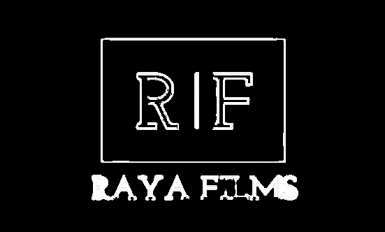

<h1 align="center">Raya-Bubolechka2 project
<p align="center">

</p>

## 🖥 Team
Raya Mavraganova

## 🚀 Languages 

<p align="left"> 
     
    
    
    
    
    
     

  ## 🔧 Tools 
  <p align="left"> 
    
    
    
      
 ## 📋 Description
    
*This app shows the latest movies that are just released in the market*   
      
 ## 📄 Documents
      
- [Word Documentation](https://github.com/RZMavraganova20/bubolechka2/blob/main/Documentation-Raya.docx)
   

</p>

## ⚙ Installation
```
You can download the project by using the green "Code" button.

Or by pasting the following code in your CMD:
git clone https://github.com/RZMavraganova20/bubolechka2.git
```
## Thank you for using our app
If you support and like our project, you can always share it with people on social media.
   
